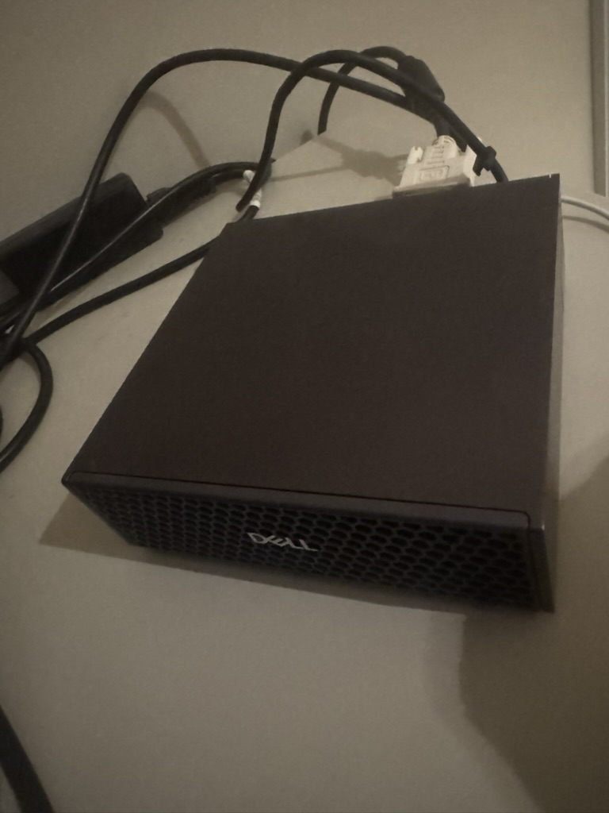
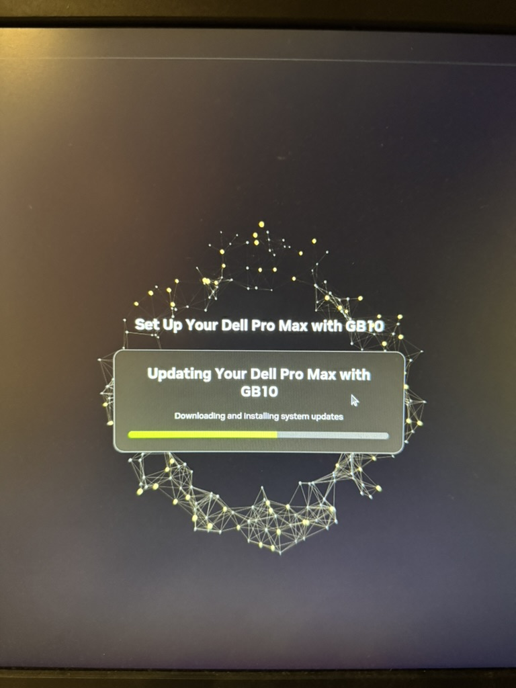
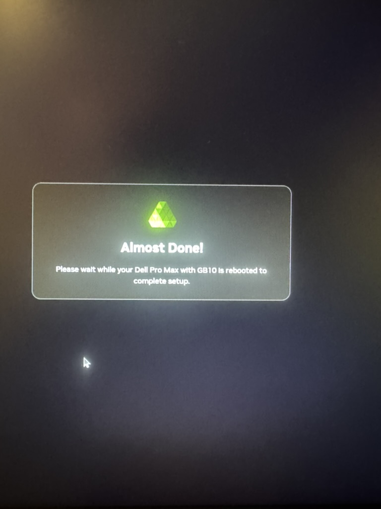
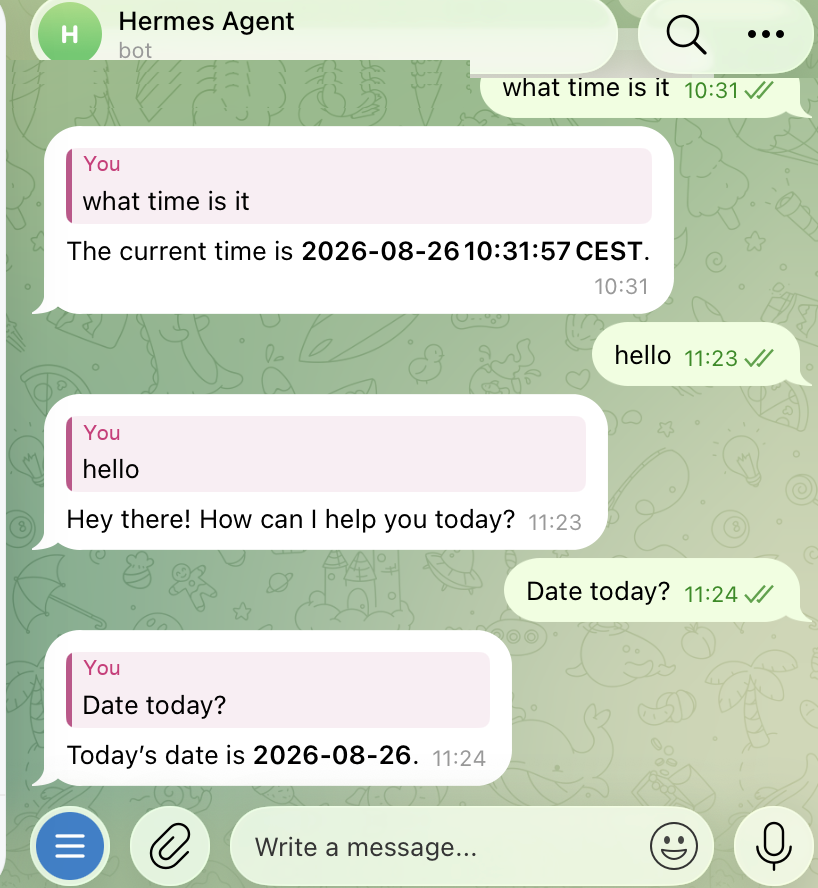
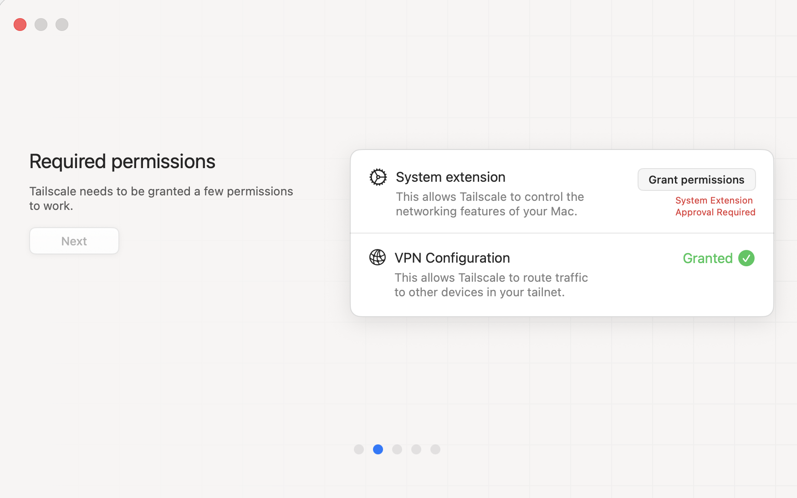
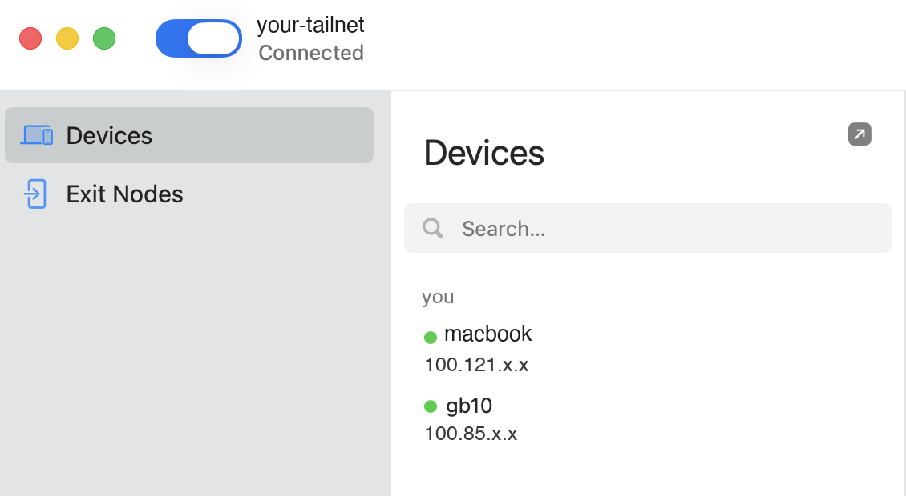
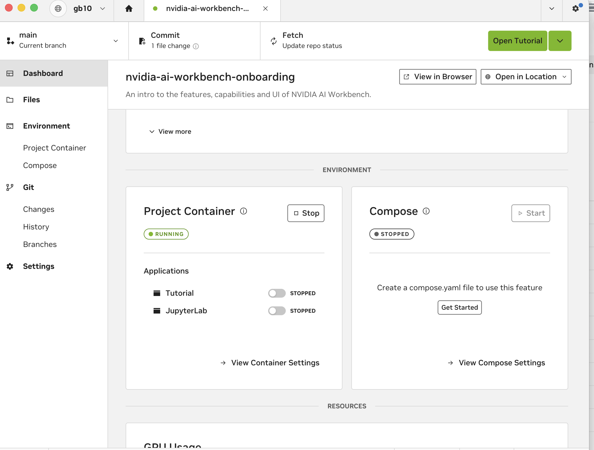

# Setting up DGX Spark GB10 with Hermes-Agent

*A 121 GB machine that runs a 120-billion-parameter model in memory, permanently, and answers from your phone*

---



*Small enough to tuck in a cupboard. 121 GB of unified memory inside.*

I have a Dell Pro Max with an NVIDIA GB10 — the DGX Spark architecture. 20 ARM cores, a Blackwell GPU, and **121 GB of unified memory**. That last number is the whole point.

Unified memory means the CPU and GPU share one pool. There's no 24 GB VRAM ceiling to quantise your way around, no offloading layers to system RAM and watching tokens crawl. A 65 GB model loads into memory and *stays* there, fully GPU-resident, with room to spare.

So I moved my [Hermes Agent](https://github.com/NousResearch/hermes-agent) onto it — off my MacBook, running `gpt-oss:120b` locally, reachable from anywhere. This is how that went, and more importantly, what it makes possible.

---

## Why move an agent off a laptop

I'd been running Hermes on an M3 Max with 48 GB. It worked well for interactive sessions, and it was hopeless for everything else.

The agent has scheduled jobs — one fires every 10 minutes. On a laptop, that's not a cron job, it's a suggestion. The machine sleeps, the lid closes, it travels, it changes networks. Anything time-based silently doesn't happen. And the model had to be small enough to leave room for actual work, so I was running a 26B alongside my browser and IDE, competing for the same memory.

The GB10 inverts both constraints:

| | MacBook M3 Max | GB10 |
|---|---|---|
| Memory for models | 48 GB, shared with everything | 121 GB, dedicated |
| Largest practical model | ~26B | **120B**, fully resident |
| Uptime | sleeps, travels | always on |
| Scheduled work | unreliable | actually runs |

The laptop becomes a thin client. The GPU lives in a cupboard and never sleeps.

---

## What this actually enables

Worth being concrete, because "run a local LLM" undersells it.

**A 120B model that's always warm.** `gpt-oss:120b` sits in GPU memory permanently — 65 GB, never unloaded. No cold start, no reload between requests. First token comes back in about a second. This is what makes background automation viable: a job that fires every 10 minutes can't afford a 60-second model load each time.

**Full 131 072-token context.** With this much memory you don't trade context for model size. Entire codebases, long document sets, multi-hour conversation histories.

**Genuinely private inference.** Every token stays in the room. No API spend, no rate limits, no data leaving the house, no provider deciding your use case violates a policy. For anything touching personal notes, internal documents, or client work, this matters more than benchmarks.

**An agent you can text.** The gateway connects to Telegram, so the agent is reachable from a phone, on cellular, anywhere in the world. Ask it something on a train and the GPU in your cupboard answers.

**Scheduled autonomy.** Cron jobs that reliably run: monitoring, summarising, checking, alerting — with a 120B model's judgement behind them rather than a shell script's.

**A remote GPU dev box.** With NVIDIA AI Workbench, containerised CUDA projects run on the Spark and are driven from the laptop. JupyterLab and VS Code in the browser, 121 GB behind them.

**Your existing tools, repointed.** Anything speaking the OpenAI or Ollama API — Cursor, Continue, Zed, Open WebUI — points at `localhost:11434` through a tunnel and transparently uses the Spark's GPU.

---

## The build

Target architecture:

```
Anywhere ──Telegram──▶ hermes-gateway ──▶ Ollama · gpt-oss:120b (GPU-resident)
Anywhere ──Tailscale─▶ SSH · Workbench · Dashboard · model API
```

Two independent paths in. Telegram needs no VPN and works from a phone. Tailscale gives full shell and tooling access. If one breaks, the other still reaches the machine — which matters for a headless box you may be far from.

**The stack:**

| | |
|---|---|
| Hardware | NVIDIA GB10 · 20 cores · 121 GB unified |
| OS | DGX OS 7 (Ubuntu 24.04.4 LTS) · kernel `6.17.0-1031-nvidia` · aarch64 |
| Driver | 580.173.02 · CUDA 13 |
| Inference | Ollama 0.32.15 · `gpt-oss:120b` · 131 072 ctx |
| Agent | Hermes Agent 0.20.x · systemd user service |
| Network | Tailscale 1.102.3 |

---

### 1. Getting in

The Spark runs DGX OS — Ubuntu underneath, ARM64, with NVIDIA's driver stack preinstalled. Out of the box it walks you through a setup wizard, pulls system updates, and reboots itself.



*First boot: the wizard fetches updates before it will let you in.*



*Let it finish the reboot. After this it's on your LAN with SSH running, and you can unplug the monitor for good.*

Worth knowing: this is the only time you need a screen attached. Everything from here runs over the network — and once SSH works, the machine can go in a cupboard permanently.

Find it by its SSH banner rather than by IP, since DHCP will move it:

```bash
nc -w2 <spark-ip> 22 </dev/null    # OpenSSH_9.6p1 Ubuntu-3ubuntu13.18
```

Then push a key and stop typing passwords:

```bash
ssh-copy-id you@yourbox.local
```

**Use the mDNS name, not a static IP.** `avahi-daemon` is already running, so `yourbox.local` resolves and follows the machine wherever DHCP puts it. Assigning a static address means guessing where your DHCP pool ends — on a `/22` that's a thousand addresses and a future address conflict. (Tailscale later makes this moot, but it's the right default from minute one.)

---

### 2. Ollama and the model

```bash
curl -fsSL https://ollama.com/install.sh | sh
ollama pull gpt-oss:120b        # ~65 GB
```

Ollama detects the GB10 correctly. In the logs you'll see it skip `cuda_v12` — the GPU is newer than that build's targets — and fall back to `cuda_v13`. That's correct behaviour, not an error. It reports `total=121.6 GiB, available=115.9 GiB`.

Now the single most important configuration change:

```ini
# /etc/systemd/system/ollama.service.d/override.conf
[Service]
Environment="OLLAMA_KEEP_ALIVE=-1"
Environment="OLLAMA_HOST=0.0.0.0:11434"
```

`OLLAMA_KEEP_ALIVE=-1` pins the model in memory forever. The default unloads after 5 minutes idle — which, against a job running every 10 minutes, means reloading **65 GB from disk on every single run**. This one line is the difference between a responsive agent and a machine permanently busy loading weights.

```bash
$ curl -s localhost:11434/api/ps | jq -r '.models[] | "\(.name) \(.size/1e9|floor)GB until \(.expires_at)"'
gpt-oss:120b 65GB until 2318-12-06T09:42:12
```

Year 2318. That's what "never unload" looks like.

`OLLAMA_HOST=0.0.0.0` makes the model reachable from Docker containers as well as loopback — needed for Workbench projects later. **Be deliberate here:** Ollama has no authentication, so this exposes your GPU to anything that can reach port 11434. On a trusted LAN behind a mesh VPN that's fine; on untrusted Wi-Fi, firewall it to the docker bridge.

Verify:

```bash
$ curl -s localhost:11434/v1/chat/completions -H 'Content-Type: application/json' \
    -d '{"model":"gpt-oss:120b","messages":[{"role":"user","content":"Say PROVIDER OK"}]}' \
    -w '\n%{http_code} in %{time_total}s\n'
PROVIDER OK
200 in 1.53s
```

---

### 3. Hermes Agent

Install, then point it at the local model:

```yaml
# ~/.hermes/config.yaml
model:
  provider: openai-api
  base_url: http://127.0.0.1:11434/v1
  default: gpt-oss:120b
  context_length: 131072
  ollama_num_ctx: 131072
```

Two things save money and surprise here.

**Set a placeholder API key.** Hermes validates credentials *before* dialling, so `provider: openai-api` demands `OPENAI_API_KEY` even though Ollama neither requires nor checks one. Without it every request fails with "Provider authentication failed" against a server that would have answered happily:

```bash
echo 'OPENAI_API_KEY=ollama-local' >> ~/.hermes/.env    # value is discarded
```

**Pin the auxiliary models too.** Hermes uses smaller models for context compression and skill selection. Left alone, those quietly route to a paid provider while your main model runs free and local:

```yaml
auxiliary:
  free_only: true
  compression:  { provider: ollama, model: qwen3:8b }
  skills_hub:   { provider: ollama, model: qwen3:8b }
```

`ollama pull qwen3:8b` and the whole stack is local.

If you're migrating an existing agent, copy `SOUL.md`, `skills/`, `memories/`, `cron/jobs.json` and the databases across — but **never `cp` a live SQLite file**. WAL mode means the `.db` alone is an inconsistent snapshot. Use `sqlite3 src ".backup dest"` and verify with `PRAGMA integrity_check`.

---

### 4. Always-on

```bash
hermes --accept-hooks gateway install
systemctl --user enable --now hermes-gateway
sudo loginctl enable-linger $USER
```

`enable-linger` is the important one — without it, user services stop when you log out, which for a headless box means "immediately".

The gateway runs both the messaging adapters and the cron scheduler, so this single service is the agent's whole always-on presence.

---

### 5. Telegram

Hermes has a pairing flow that creates the bot and configures the allowlist:

```bash
hermes telegram setup
```

It prints a link (install `qrcode` in the venv and you get a scannable QR instead). **The link expires in about 180 seconds** — have your phone in hand before you start; my first attempt timed out.

This is the part that surprised me most in daily use. The agent is now reachable from anywhere without a VPN, without port forwarding, without a public IP — because the Spark dials *out* to Telegram and holds the connection open. That outbound-only property makes a chat bot an excellent control plane for a home server: it traverses NAT by not needing to.



*Every one of these replies was generated by `gpt-oss:120b` on the GB10. No API, no cloud, no data leaving the house.*

Ask it something from a train; the GPU in the cupboard answers.

**Add a watchdog.** The Telegram adapter can lose its polling loop after a network blip while the process stays alive and systemd still reports `active`. Health-check the *work*, not the process:

```bash
pending() { curl -s "https://api.telegram.org/bot$TOKEN/getWebhookInfo" \
            | jq -r '.result.pending_update_count'; }

[ "$(pending)" -gt 0 ] || exit 0    # queue empty — healthy
sleep 45                            # might just be a slow turn
[ "$(pending)" -gt 0 ] || exit 0    # drained — fine
systemctl --user restart hermes-gateway
```

On a systemd timer every 5 minutes. Two things worth knowing: use `getWebhookInfo`, **never `getUpdates`** — Telegram allows one polling consumer per bot, so calling `getUpdates` yourself steals the session from your own adapter and manufactures the errors you're trying to detect. And recovery is lossless: Telegram retains undelivered updates for ~24 hours, so a restart replays the queue.

---

### 6. Tailscale

Everything so far works on the LAN. Tailscale makes it work everywhere.

It's a WireGuard mesh — both machines dial out to a coordination server, then connect directly. Nothing inbound, nothing exposed to the internet, devices mutually authenticated. Compared to forwarding port 22 to the world and layering on dynamic DNS, it isn't close.

```bash
# Spark
curl -fsSL https://tailscale.com/install.sh | sh
sudo tailscale up --hostname=gb10

# Mac
brew install --cask tailscale-app
```

On macOS you'll be asked to approve a system extension — that's what lets Tailscale create the network interface it routes tailnet traffic over. VPN Configuration is granted during install; the extension needs a manual approval in System Settings.



*Approve the system extension. If the app appears to hang afterwards, quit and relaunch it — it needs a restart to pick up the newly-installed extension.*

```
100.121.x.x     my-macbook   macOS
100.85.x.x      gb10         linux

$ tailscale ping gb10
pong from gb10 (100.85.x.x) via 192.168.x.x:41641 in 77ms
```



*Two devices, two permanent addresses. These don't change — not when DHCP reshuffles, not when I'm on another continent.*

Note the `via` a LAN address — on the same network it connects **directly** rather than relaying. You don't pay a detour for being home.

Then point everything at the stable name:

```sshconfig
Host gb10
    HostName gb10.yourtailnet.ts.net
    User you
    LocalForward 11434 localhost:11434   # model API
    LocalForward 11000 localhost:11000   # DGX Dashboard
    LocalForward 10000 localhost:10000   # AI Workbench
```

Now `ssh gb10` and `localhost:11434` work identically at home and abroad.

> **Disable key expiry** in the Tailscale admin console. Device keys expire after ~180 days by default; on a headless server that's a lockout, because re-authenticating needs `sudo tailscale up` on the machine itself. Do it at setup, not while travelling.

A bonus: the tailnet address is permanently stable, so DHCP can shuffle the LAN as much as it likes and nothing you've configured breaks.

---

### 7. NVIDIA AI Workbench

DGX OS ships Workbench preinstalled. Install the desktop app on your laptop, add the Spark as a **Manual SSH** remote location — reusing the key you already have, rather than letting NVIDIA Sync generate a second one — and you get containerised GPU projects on the Spark, driven from the laptop.



*The project container runs on the Spark; the UI runs on the laptop. Note the location selector reading `gb10` — JupyterLab and the tutorial launch straight into the GPU.*

Point it at the tailnet hostname and it works from anywhere too.

Inside a project container, the model lives at `http://host.docker.internal:11434` — *not* `localhost`, which is the container itself. This is why `OLLAMA_HOST=0.0.0.0` earlier mattered: bound to loopback, Ollama is invisible to Docker's bridge network.

---

## The result

```
$ hermes chat -q "Reply with exactly: PIPELINE OK" --max-turns 1
PIPELINE OK        # 18s, fully local
```

- A 120B model resident in GPU memory, permanently warm, 131 k context
- An agent reachable by text message from anywhere on earth
- Scheduled jobs that actually run, every 10 minutes, forever
- Full shell, dashboard and containerised GPU dev from any network
- Zero API spend, zero data leaving the building
- 43 GB freed on the laptop, now a thin client

---

## Gotchas worth knowing

None of these were hard once identified — but several present misleading errors, so they're worth recognising on sight.

**`no route to host` on macOS may be a privacy setting.** macOS 15+ requires apps to be granted **Local Network** access, and denial surfaces as `EHOSTUNREACH` — indistinguishable from a genuine network fault. The tell: `ping` and `ssh` work (Apple's platform binaries are exempt) while third-party tools insist the host is unreachable. System Settings → Privacy & Security → Local Network. Tailscale sidesteps it entirely, since tailnet traffic isn't "local network".

**`systemctl is-active` answers the wrong question.** It reports whether a process is alive, not whether it's doing its job. Both silent failures I hit — the Telegram stall and a misconfigured provider — happened under a green service. Health-check end-to-end.

**DHCP will move the machine.** Mine drifted from `.62` to `.80` and another device with a randomised MAC took the old lease. Use mDNS, then tailnet names. Every address I hard-coded eventually became wrong.

**`ollama list` can disagree with the API.** Straight after a pull it may return empty while `/api/tags` shows the model present. Trust the API.

**Restarting Ollama evicts the model.** `KEEP_ALIVE` pins it *after* load, so warm it deliberately after any restart rather than letting a user discover the 60-second reload.

**Ubuntu's `.bashrc` early-returns for non-interactive shells.** `ssh host 'mytool'` fails with "command not found" despite the PATH export being right there in the file — execution never reaches it. Use absolute paths over SSH.

**SSH tunnel noise is harmless.** With a background tunnel already holding the ports, every subsequent command prints `bind: Address already in use`. The first connection owns them; the rest complain and work fine.

**macOS ships rsync 2.6.9** — from 2006, and it rejects modern flags. Install a current one before migrating anything large.

---

## Next

The one physical thing left: mine is on Wi-Fi, where I measured LAN latency swinging between 7 and 201 ms. For an always-on box doing file sync, a cable is the single biggest remaining improvement. Ethernet is the last mile, literally.

Beyond that — more scheduled jobs. The interesting shift isn't that a 120B model runs locally; it's that having one *permanently warm and always reachable* changes what's worth automating. Tasks you'd never wire up against a metered API become obvious when inference is free, private, and already loaded.

---

*Dell Pro Max GB10 · DGX OS 7 / Ubuntu 24.04.4 · Hermes Agent with Ollama and `gpt-oss:120b`. Identifiers changed.*
