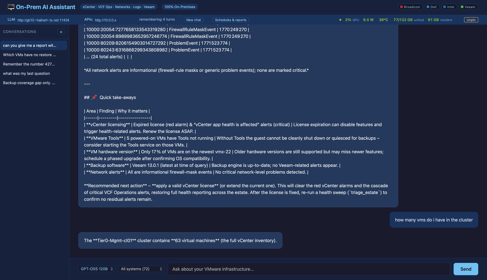
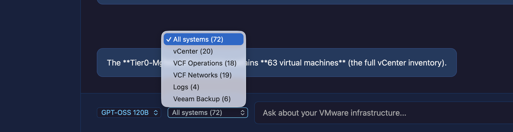
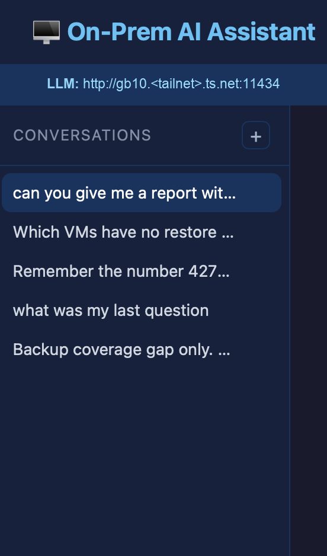
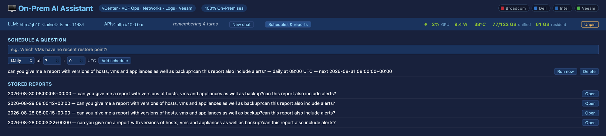

# The GPU in the cupboard found 52 unprotected VMs

*What happened when the always-on 120B model stopped answering questions and started asking them*

---

In the [last post](#) I put an NVIDIA GB10 in a cupboard, loaded `gpt-oss:120b` into its 121 GB of unified memory, and left it there permanently warm. The closing line was that having a model *always resident and always reachable* changes what's worth automating — that tasks you'd never wire up against a metered API become obvious when inference is free, private and already loaded.

This is that claim being tested.

The short version: I pointed the warm model at my VMware datacenter through a read-only API layer, asked it whether anything was wrong, and it told me that **52 of 63 virtual machines have no backup at all** — including two domain controllers and, with some irony, the machine hosting the assistant itself.

Nobody had been careless. The backup tool had been reporting *zero unprotected objects* for months, and it was telling the truth.

One thing to state plainly up front, because it changes how you should read the rest: **this is a lab.** A full VCF stack — vCenter, NSX, Operations, Log Insight, Veeam — built to mirror a real datacenter, but nothing on it is a workload anyone would miss. That's deliberate; it's what makes it safe to point an LLM at. So the interesting finding here isn't *"52 machines are one failure away from gone"*. It's that four monitoring systems reported everything fine, and a plainly-worded question found otherwise in about ninety seconds — and that method transfers to somewhere the answer would actually hurt.



---

## The topology inverted

The first article had the laptop as a thin client to a box in a cupboard. That was still a laptop story — the GB10 was a bigger place to run the same personal agent.

What it turned into is stranger, and better:

```
Mac (client) ──Tailscale──▶ Orchestrator (datacenter VM) ──▶ five read-only APIs
                                     │                        vCenter · VCF Ops
                                     └──Tailscale──▶ GB10      Networks · Logs · Veeam
                                                    gpt-oss:120b, resident
```

Inference happens **at home**, on a shelf. The agent loop and the web UI run **in the datacenter**, next to the systems they read. My laptop is a browser and nothing else — it holds no model, no credentials, no data.

That split matters more than it looks. The orchestrator sits where the APIs are, so those queries never cross the internet; only the prompt and the answer do. And the thing that would be most expensive to put in a datacenter — 121 GB of GPU memory — is the one part that lives in a cupboard.

**The stack:**

| | |
|---|---|
| Inference | GB10 · `gpt-oss:120b` · 61 GB resident · 131 072 ctx |
| Orchestrator | Photon VM · Python · FastAPI · 72 tools across 5 systems |
| Interface | Web UI · threaded history · CSV/PDF export · scheduled reports |
| Datacenter | vCenter 9.0.2 · 5 × ESXi 9.0.1 · 63 VMs |
| Transport | Tailscale, three nodes, tag-scoped |
| Tests | 223, run before every deploy |

---

## Five systems, one question

The last article had the model answering from its own weights. This one has it answering from the datacenter, through five read-only API wrappers running as services on a single Windows box — one per system, each fronting a product API that speaks a different dialect:

| System | Tools | What it answers |
|---|---|---|
| **vCenter** | 20 | Inventory, hosts, clusters, datastores, alarms, VM state, hardware versions, Tools |
| **Operations for Networks** | 19 | VM-to-VM flows, IP and port-group mapping, VLANs, network events |
| **VCF Operations** | 18 | Capacity, health, efficiency, chargeback, active alerts |
| **Veeam** | 6 | Jobs, sessions, restore points, repositories, protected objects |
| **Operations for Logs** | 4 | The actual log entries behind an event, by time window and query |
| **Cross-system** | 5 | `triage_vm`, `triage_host`, `triage_estate`, `backup_coverage`, `estate_versions` |

Seventy-two in total, exposed to the model as functions. Almost all of them read.



That last row is the interesting one. Five tools belong to no single product because the questions they answer don't either — *is this VM healthy*, *is everything patched to the same version*, *is any of this backed up*. Those are joins, and they're the reason the thing exists.

Logs and Veeam were the two most recent additions, and they're what changed the character of the answers. Before them, the assistant could tell you an alarm existed. Now a single question can cross all three axes: *VCF Operations says this host is unhappy — what do the logs say happened at that timestamp, and is anything on it backed up?* Any one of those systems has a perfectly good UI of its own; what none of them has is the other four.

It's also where the honesty rules earn their keep. Five backends means five things that can be down, so a triage reports per-section failures instead of aborting, and says which sections it *couldn't* examine. An answer assembled from four of five systems that doesn't mention the fifth is worse than no answer.

The dropdown above narrows the scope when you already know where you're looking — which also trims the schemas sent to the model, so it isn't choosing between seventy-two options to answer a question about backups.

### What it's allowed to do

The previous incarnation of this project claimed "read-only by design" in an article, and I later admitted in passing that I'd removed the protection because it was a lab. That's the kind of small dishonesty that's worth not repeating, so this time the constraint is mechanical rather than aspirational:

- **Writes are proposals.** A state-changing tool returns a description and a token. Nothing happens until a human confirms it.
- **Scheduled runs are read-only regardless of configuration.** Not "read-only by default" — the write schemas are withheld entirely from an unattended run, and an invented write-tool name is refused. Nobody is watching a job that fires at 07:00.
- **There's a test that fails if the registry ever contains no write tools**, so the previous guarantee can't pass vacuously by accident.

That last one is a habit worth stealing generally. A test asserting "unattended runs can't write" passes beautifully in a system that can't write at all. Pin the premise too.

---

## Sharing one GPU with itself

Here's a constraint the first article didn't hit, because it only ever ran one thing.

The GB10 has a single pool of unified memory and no MIG partitioning. A 61 GB model pinned resident is 61 GB that nothing else can have. The moment I wanted to run an NVIDIA NIM container under AI Workbench on the same box, the always-warm assistant became the thing standing in the way — the feature and the obstacle were the same feature.

The obvious fix is to stop pinning the model. But then the assistant pays a cold start of tens of seconds on every first question, which is precisely what made scheduled autonomy viable in the first place.

The actual fix is that residency should be a **control**, not a setting. Ollama accepts a per-request `keep_alive` that overrides its service default, and a request carrying no prompt loads or evicts the model without generating anything. So:

```
keep_alive: -1   →  load and hold indefinitely   (pin)
keep_alive:  0   →  evict right now              (unpin)
```

Two endpoints on the orchestrator, and a button in the web UI that shows what's resident and how many gigabytes it's holding. Pinning a 120B reloads it from disk, so the button says *Loading…* and reports how long it took — usually tens of seconds, which is honest and worth seeing rather than hiding behind a spinner.


61 GB of the 122 GB unified pool held by the model, 77 GB in use overall, drawing 9.4 W at idle — a 120-billion-parameter model sitting warm and costing almost nothing to keep there. Press *Unpin* and that 61 GB comes back.

The point is what it does to the workflow. A shell script wraps the same endpoints:

```bash
./scripts/spark-nim up      # evict the assistant, start NIM
./scripts/spark-nim down    # stop NIM, re-pin the assistant
```

`up` notices there isn't enough free memory, works out that the assistant is almost certainly why, and releases it. `down` puts it back. The two workloads now take turns on one GPU without touching systemd on the inference host or SSHing anywhere.

Not parallel — 121 GB doesn't stretch that far, and pretending otherwise would just produce two things that swap and thrash. But *serially, on demand, from a browser*, which is the difference between "I have a dev box" and "I have a dev box I actually use."

One bug worth recording, because it's a good example of a whole class. The compose file writes `ASSISTANT_MODEL=` when the variable is unset. `os.getenv("ASSISTANT_MODEL", DEFAULT_MODEL)` handles *absent*; it does not handle *present and empty*. The model name became the empty string, and pinning silently pinned nothing.

---

## From a chat box to something you'd actually use

The first article ended promising more scheduled jobs. This is that, plus the unglamorous things that turned out to matter more than any of the model work.

**It remembers.** Every turn is stored server-side against a conversation id, and the last several turns are replayed on each request — so "and which of those are powered on?" resolves against what "those" meant, instead of starting from nothing. The id is persisted in the browser too, so closing the laptop lid and coming back doesn't quietly start a new thread.

**There's a sidebar.** Past conversations are listed down the left with their first question as the title and a relative timestamp, click to reopen, and a delete for the ones that were experiments. Trivial to build, and it changed how I use the thing completely: questions stopped being disposable. The morning check is now a thread I return to, not something I retype.



**Answers leave the browser.** Nobody's decision-maker is going to read a chat transcript.

- Every table the model produces gets a **Download CSV** button — UTF-8 with a BOM so Excel doesn't mangle it, markdown emphasis stripped so a cell reads `Low (degradation)` rather than `**Low** (degradation)`.
- **Export PDF** opens a clean print view and calls the browser's own PDF writer. No PDF library, deliberately: a box that talks to five live systems should not be pulling a vendored megabyte off a CDN to print a report. The print stylesheet hides the UI chrome, repeats table headers across pages, avoids splitting rows, and stamps the output with the question asked, the model, the timestamp, and *source: live datacenter APIs, read-only* — because a table in a PDF with no provenance is just a claim.

**And it runs without me.** Schedules are hourly, daily or weekly, all in UTC — a report that shifts by an hour twice a year is a bug nobody notices until the reports have been wrong for months. Runs are stored with their answer, the tools called, and the token usage, and due jobs fire strictly one at a time — three tool-calling runs hitting five APIs at once is a self-inflicted load test.

Four decisions in there are worth more than the feature itself:

- **A scheduled run gets no write tools at all** — and the schedule form has no way to opt out of that.
- **The schedule is advanced *before* the run starts.** A run that crashes the process must not leave the job permanently due and re-firing on every restart.
- **A recurring job is told what it said last time**, so the 07:00 report leads with *what changed* — and is explicitly instructed to say when nothing has, rather than padding.
- **A failed run is recorded, not swallowed.** The failure mode worth designing against isn't a job that errors; it's a job that quietly stopped producing reports while the service stayed green.

The due-time arithmetic lives in its own module as pure functions over an explicit "now", so the awkward cases — a daily job created after today's slot has passed, a weekly job created on its own weekday, a service restarted after a day of downtime — are unit-testable without waiting on a clock. And a schedule that could never fire is rejected at creation rather than stored: `hour=25` looks perfectly fine in a list and simply never runs.



That screenshot is the part I find most satisfying, and it's the least impressive-looking thing in this post. Four stored reports, three of them from consecutive mornings at 08:00 UTC, produced by a box in a cupboard while I was asleep — each one a full datacenter sweep across five systems, each one still openable months later.

---

## The question that mattered

With the plumbing done, the real test was whether a local model reading live infrastructure produces anything you couldn't get from a dashboard.

I asked it what was wrong with the datacenter. It came back with vCenter alarms, expired licences, VMs on old hardware versions, VMware Tools out of date — the usual hygiene, correctly ranked, with tables I could export to CSV or PDF.

Then I asked about backups, and it said something more interesting than an answer:

> Veeam reports 0 objects without restore points. However, this only covers objects Veeam already knows about. I have no tool that can enumerate every protected object, so I **cannot** tell you which vCenter VMs are absent from backup entirely.

It returned an empty table rather than inventing one. That refusal was the most valuable output the system produced, because it identified a gap in *itself*.

And it was right. The `unprotected` endpoint fetched Veeam's backup objects and then filtered out everything that had a restore point — discarding exactly the data needed to answer the question. It could only ever describe objects already in a job. A VM nobody had added to a job simply did not exist as far as that query was concerned.

So the headline number was true and useless:

> **0 objects without restore points** — measured over **11 objects**, in a datacenter of **63 VMs**.

The reassuring answer and the dangerous answer looked identical.

---

## Doing the join properly

The fix was not a cleverer prompt. Asking a model to match 63 names against 11 by hand is asking it to make something up, and this one honourably declined rather than guessing — which is the better failure, but still not an answer.

Two changes:

1. **A new endpoint returning Veeam's full roster**, including objects with zero restore points, paged properly and reporting whether the fetch was complete against the server's own total. A half-fetched roster would invent unprotected VMs, so a partial result has to be able to say so.
2. **The join done in code, not in the model.** Fetch the entire vCenter inventory, fetch the entire Veeam roster, normalise names for case and DNS suffix, diff them, and return the gap.

Crucially it distinguishes two failure modes that look the same in a summary and mean completely different things:

- **absent from Veeam entirely** — never protected, nobody ever added it
- **present with no restore point** — a job exists and is failing

And if either system is unreachable, it reports coverage as **unknown** rather than falling through to a count that reads like a pass. An unavailable check is not a passed check.

The result, live:

| | |
|---|---|
| VMs in vCenter | **63** |
| Objects known to Veeam | **11** (roster complete) |
| VMs with a restore point | **11** |
| **VMs with no restore point** | **52** |

Of those 52, roughly nine are templates and nine are nested ESXi VMs — arguably excluded on purpose. That still leaves **around 26 powered-on, real workloads with no backup whatsoever**, including two domain controllers, all three NSX managers, the log appliance, and the two machines hosting this assistant's own API layer.

The demo was not backing itself up.

---

## Who is actually asking?

Everything above runs behind a tailnet, and for a while I treated that as the security story. It isn't. A tailnet answers *which machines can connect*. It says nothing about *who is at the keyboard* — and those are different questions the moment a device is shared, borrowed, or left unlocked.

What was actually sitting there was a chat box wired to five infrastructure systems, answering anyone who could open a socket to it, with an API beside it on another port that would run all 72 tools without so much as asking a name.

The fix turns out to be almost free, because `tailscale serve` already knows who you are. It terminates TLS and adds the caller's identity to every request it forwards:

```
Tailscale-User-Login: someone@example.com
Tailscale-User-Name:  Some One
```

The obvious worry is that a header is the easiest thing in the world to fake. So I tested it rather than trusting it, and the result is the part worth internalising:

| Path | Forged `Tailscale-User-Login` |
|---|---|
| Through `tailscale serve` | **Overwritten** with your real identity |
| Straight to the app's port | **Passes through untouched** |

The header isn't trustworthy. *The header on the proxied path* is trustworthy. That distinction is the entire design, because it means the header is worthless on its own — you also need certainty about which path the request took.

That certainty is a network property, not an application one: bind the service to `127.0.0.1`, and the only thing that can connect is the proxy on the same machine. So the two checks answer two different questions, and neither is sufficient alone.

| Layer | Answers | Guaranteed by |
|---|---|---|
| Loopback bind | *Did this come via the proxy?* | The kernel — you can see it in `ss -lntp` |
| Identity header | *Who sent it?* | Tailscale — only meaningful given the row above |

Which is why the service now refuses to start if you ask for identity checking while bound to `0.0.0.0`. That combination isn't half-secure, it's decorative — anyone who can reach the port supplies their own name — and a configuration that *looks* protected is worse than one that obviously isn't.

You can watch both halves work from opposite directions. Through the tailnet URL, `/api/whoami` returns my login. From a root shell on the box itself, a foot away from the process, the same request is refused — because a local shell can't produce an identity, and can't forge one, since the only path that sets that header overwrites whatever you send.

### The bit that nearly locked me out

I wrote thirteen tests. All thirteen passed. The implementation would have locked me out of my own datacenter completely.

Uvicorn, by default, honours `X-Forwarded-For` from a local proxy and rewrites the recorded peer address to the *original* caller. Perfectly sensible — it's how you get real client IPs in your logs. But it means that behind `tailscale serve`, the peer my code inspected wasn't `127.0.0.1`. It was the tailnet address of whoever was asking. My loopback check would have rejected **every legitimate request**, including mine, on a service reachable only remotely.

The tests didn't catch it because the test client doesn't run that middleware. They were exercising a stack that doesn't exist in the deployed service, and reporting green on it.

I only found it by running the real thing behind a real proxy before shipping. The bind now disables that rewrite deliberately, and a request whose peer address has been rewritten returns a 403 that names the cause — because the next person to hit this deserves better than a blank refusal.

---

## The pattern underneath all of it

Every serious problem in this project has been the same problem wearing different clothes: **something reported success for a thing it never checked.**

- `systemctl is-active` said the agent was running. It was running. Its Telegram loop had stalled hours earlier.
- Veeam said zero unprotected. It was counting only what it already knew about.
- The chat pane said memory was working. The server's memory *was* working perfectly — the browser was starting a new conversation on every reload, because the id lived in a JavaScript variable that a refresh threw away. The comment above that variable claimed a reload picked the thread back up. It never had.
- My own web UI returned a blank `500`. The orchestrator had sent a precise explanation; `raise_for_status()` in the proxy threw it away and substituted nothing. The one fact needed to diagnose the fault was being destroyed at the last hop.
- Tailscale showed my laptop **online, healthy, key valid, zero warnings** — and zero peers, because I'd tagged the machine. Tagging transfers ownership from the user to the tag, so every policy rule keyed to "me" stopped matching. A node in perfect health that could see nothing.
- And then my own test suite did it to me. Thirteen tests, all green, on authentication that would have refused every real request. They were testing a stack that doesn't exist outside the test suite.

None of these were subtle once seen. All of them presented as a green light.

The habit that catches them isn't cleverness, it's refusing to accept a status as evidence of the thing it's a proxy for. Health-check end to end. Ask what population a clean result was computed over. And when a test passes, break the code deliberately and confirm the test fails — a test that passes against the bug is worth less than no test, because it actively reassures you.

---

## Gotchas worth knowing

**Pydantic will accept an omitted field and reject an explicit `null`.** `conversation_id: str = None` type-checks fine, works in every unit test that builds the model in Python, and rejects every request a browser actually sends — because the browser sends `null` rather than omitting the key. Defaults aren't validated; supplied values are. `Optional[str]`.

**`with sqlite3.connect(...)` commits but does not close.** One leaked file descriptor per request. Invisible in a sub-second test run, fatal over weeks of uptime.

**A Tailscale policy file uses either `acls` or `grants`, never both.** Advice written for one syntax is rejected outright in the other. Check which your file uses before pasting anything — including anything an AI hands you.

**You can't untag a machine from the admin console.** Removing all tags requires reauthenticating the device; whoever reauthenticates becomes its owner. And `tailscale up` replaces your whole preference set, so it refuses to run unless you restate every non-default flag — a guardrail that looks like an error.

**A "next run" time must be strictly after now, not at-or-after.** Off by one comparison operator and a job that has just finished is immediately due again, and loops as fast as the scheduler ticks. Due-time arithmetic is where scheduling bugs live; keep it in pure functions you can hand an arbitrary "now".

**Tagged nodes have key expiry disabled.** That's the right property for an unattended server and the wrong one for a laptop. Tag the boxes in the cupboard, not the thing in your bag.

**Your web framework may rewrite the client's IP address behind your back.** Uvicorn trusts `X-Forwarded-For` from a local proxy by default and rewrites the peer address to match. If any security decision you make depends on the connection coming from localhost, that default silently inverts it — and your tests won't tell you, because test clients skip the middleware that does it.

---

## What's still unresolved

Being honest about the ragged edges, since the interesting part of a homelab writeup is usually the part still on fire:

- **26 real workloads still have no backup.** Lab workloads, so nothing is at stake here — but the fix is as unglamorous as the finding was easy, and it still isn't done.
- **The datacenter's own alerting is louder than its worst problem.** VCF Operations is carrying 99 active alerts. A red "Backup job status" alarm has been showing since April. When everything is red, nothing is.
- **No authorisation, only authentication.** The UI now knows who you are and can be restricted to named accounts, but everyone who gets in gets the same 72 tools. Fine for a proof of concept in a lab; not fine anywhere real, where a read-only viewer has no business triggering a scheduled report against live infrastructure. Roles are the obvious next step, and the tools are already grouped by scope, so the seam is there.
- **The Veeam service account is an administrator.** It should be a read-only account, and the fact that everything it does is read-only by convention is not the same as by permission.
- **The access path needs sign-off.** A personal tailnet terminating on a work VM that reaches five infrastructure systems is a conversation to have with your employer *before* you build it, not after. I'm having it.

---

## Was it worth it?

The benchmark answer is boring: yes, a 120B model runs well on a GB10, first token in about a second, 131k context, no API bill.

The real answer is that none of that is why it mattered. What mattered is that a permanently warm model, wired to read-only APIs and asked a plain question, surfaced a data-loss risk that four separate monitoring systems had been quietly reporting as fine for months — and then, when asked something it genuinely couldn't answer, said so instead of guessing.

The GPU in the cupboard isn't valuable because it's fast. It's valuable because it's always there, it costs nothing per question, and everything it reads stays in the building — so you ask it things you'd never bother to ask anything else. And because it's always there, it can ask them for you at seven in the morning, and have the PDF waiting.

---

*Dell Pro Max GB10 · DGX OS 7 / Ubuntu 24.04.4 · `gpt-oss:120b` via Ollama · orchestrator on Photon OS · VMware Cloud Foundation 9. Identifiers changed; all datacenter figures are real.*
